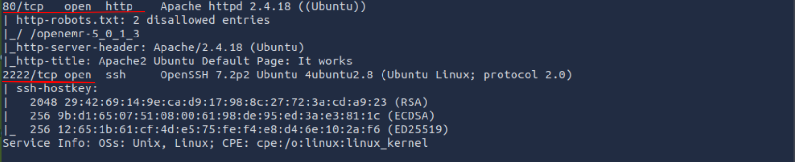
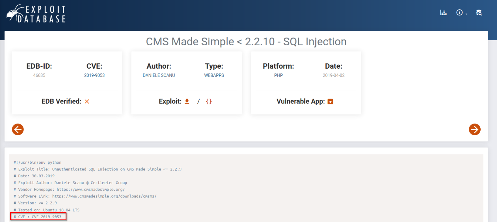
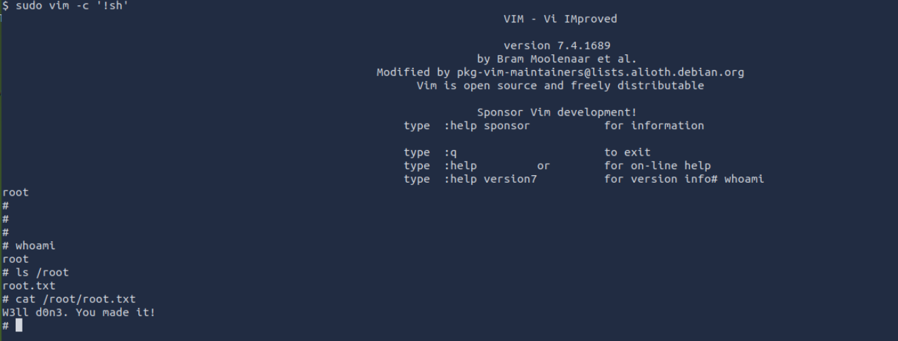

## Introduction

Before we start, I need to say that this is my first ever writeup and also my first CTF, so I hope you enjoy it.  
For a working environment, you can go to [simple ctf](https://tryhackme.com/room/easyctf) and run the machine. You can use your own machine as an attack box using OpenVPN, or you can just stick to the attack box provided in the room for a simple setup like I did. Now let's start.

## Scanning

```bash
nmap -sCV MACHINE_IP
```

  


> How many services are running under port 1000?  
2 

> What is running on the higher port?  
ssh

## Initial Access

So now from scanning we know that the server is running three services (ssh, ftp, http), and Anonymous FTP login is allowed.  
Let's start with **http**:  
If we check http://MACHINE_IP in the browser, we found nothing but the default Apache web page.  
 
We need to go deeper. 
We can use gobuster to check for subdirectories.

```bash
gobuster dir -u http://MACHINE_IP -w /usr/share/wordlists/dirb/big.txt
```

 
We found a subdirectory called /simple/. Now if we go to the URL, we see this page.  
 
A little bit of research on the page and we found that this website uses a CMS called "CMS Made Simple", so maybe we can exploit that.  
 
If we check exploit database, we found a [CVE](https://www.exploit-db.com/exploits/46635).  


> What's the CVE you're using against the application?  
 CVE-2019-9053  

> To what kind of vulnerability is the application vulnerable?  
sqli 

 So we're gonna use this CVE to exploit the site. The script provided in the PoC is Python 2. 
 We're gonna use a new version, Python 3. 
 
 Updated version of the exploit script:
```bash
git clone https://github.com/Mahamedm/CVE-2019-9053-Exploit-Python-3.git
cd CVE-2019-9053-Exploit-Python-3/
pip install -r requirement.txt
```

Now we are ready to crack the system.

```bash
python3 csm_made_simple_injection.py -u http://MACHINE_IP/simple -w /usr/share/wordlists/rockyou.txt --crack
```

Run the script and wait. Yay, we done it! We get the password and username.  


> What's the password?  
 secret 

> Where can you login with the details obtained?  
ssh 

Now using the username and password we discovered, we can now try to SSH into the target machine.  
 

> What's the user flag?  
G00d j0b, keep up!  

> Is there any other user in the home directory? What's its name?  
 sunbath

## Privilege Escalation

```bash
sudo -l
```

 _Note_: `sudo -l` lists **what commands the current user is allowed to run with sudo privileges**

> What can you leverage to spawn a privileged shell?  
> vim

```bash
sudo vim -c '!sh'
```



> What's the root flag?  
> W3ll d0n3. You made it! 
 
And that's it, we made it! I hope you enjoyed this writeup.
